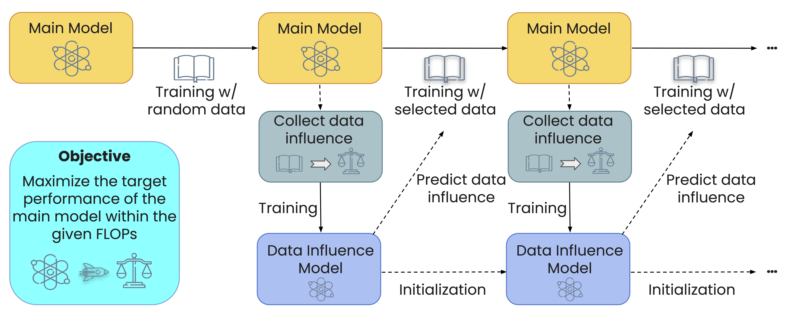

# MATES: Model-Aware Data Selection for Efficient Pretraining with Data Influence Models

This is the official repository for [MATES: Model-Aware Data Selection for Efficient Pretraining with Data Influence Models](https://arxiv.org/pdf/2406.06046). The implementation is mainly based on [LitGPT](https://github.com/Lightning-AI/litgpt), which is easy to begin with, use, and modify.

<br>
<p align="center">

</p>
<br>

## Quick Links

- [1 Environment](#1-environment)
- [2 Dataset](#2-dataset)
- [3 Experiments](#3-experiments)
  - [3.1 Pretraining](#31-pretraining)
  - [3.2 Data Selection](#32-data-selection)
  - [3.3 Evaluation](#33-evaluation)
- [4 Citation](#4-citation)

## 1 Environment

**Python version**

The code is tested on Python 3.9.17.

**Install basic dependencies**

```bash
pip install -r requirements.txt
```

## 2 Dataset

We use a tokenized version of the [C4 dataset](https://huggingface.co/datasets/loganengstrom/dsdm-candidate-c4) in our code. Please ensure your disk has at least 500 GB of storage for this dataset. To get the training data for the initial warmup 10k steps, please run:

```bash
python src/select_data/select_data.py
```

- The selected data will be saved in `data/c4/pythia-410m/random/0`.

For preprocessing our reference task LAMBADA, please run:

```bash
python src/select_data/prepare_lambada.py
```

- The processed data will be saved in `data/lambada_openai`.

## 3 Experiments

Our main experiments use 8 GPUs for parallelization.

### 3.1 Pretraining

Our pretraining is run stage by stage to facilitate the model-aware data selection. Each stage consists of 10k steps. For instance, in the initial warmup 10k steps, you can run:

```bash
model_name=pythia-410m \
method=random \
ckpt=0 \
bash scripts/pretrain.sh
```

- `ckpt=0` denotes we are training from scratch.

To resume the pretraining from previous steps (e.g., 10k), you can run:

```bash
model_name=pythia-410m \
method=random \
ckpt=80000 \
bash scripts/pretrain.sh
```

- `ckpt=80000` denotes our gradient accumulation step is 8.
- `method=random` is the random data selection. You can replace it with `mates` for MATES after the first 10k steps.

### 3.2 Data Selection

1️⃣ Get oracle data influence:

```bash
model_name=pythia-410m \
method=random \
ckpt=080000 \
bash scripts/probe_oracle_data_influence.sh
```

- For the 10k checkpoint, `methods=random`, but for the following, `methods=mates`.

2️⃣ Train data influence model:

```bash
model_name=pythia-410m \
ckpt=080000 \
bash scripts/train_data_influence_model.sh
```

3️⃣ Predict data influence:

```bash
model_name=pythia-410m \
ckpt=080000 \
bash scripts/predict_data_influence.sh
```

4️⃣ Select the training data for the next 10k steps:

```bash
python src/select_data/select_data.py --model_name pythia-410m --method mates --ckpt 80000
```

- The selected data will be saved in `data/c4/pythia-410m/mates/80000`.

### 3.3 Evaluation

1️⃣ It is advised to run the evaluation after the decay stage for intermediate checkpoints for better stability.

```bash
model_name=pythia-410m \
method=random \
ckpt=80000 \
decay=true \
bash scripts/pretrain.sh
```

2️⃣ We provide a simple evaluation example here and you can modify the parameters based on your needs.

```bash
model_name=pythia-410m \
method=random \
ckpt=081600 \
bash scripts/eval.sh
```

- After running the evaluation script, you can find the results in the `results/c4/$model/$method/iter-$ckpt-ckpt/results.json`.

## 4 Citation

Please cite our paper if you use MATES in your work:

```bibtex
@article{yu2024mates,
   title={MATES: Model-Aware Data Selection for Efficient Pretraining with Data Influence Models},
   author={Yu, Zichun and Das, Spandan and Xiong, Chenyan},
   journal={arXiv preprint arXiv:2406.06046},
   year={2024}
}
```
